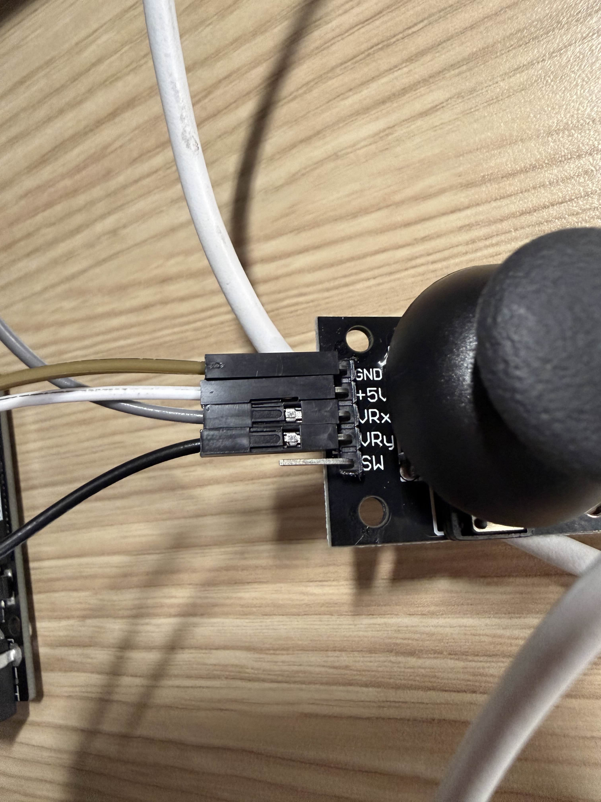

# arduino-joystick-direction-leds
Embedded systems mini project: joystick direction detection with real-time LED indicators on Arduino (analog A0/A1 → LEDs on D2–D5).
## Demo Video
[Watch the demo on Google Drive](https://drive.google.com/file/d/1FYEbfD1218KfVaZC9K-R0HdzNIjAdKCO/view?usp=sharing)
## Wiring Photos

